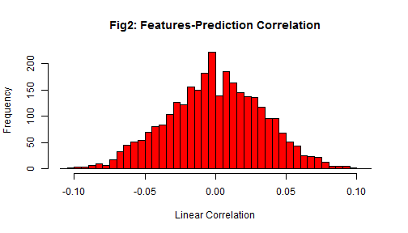

Classifying Multiple Authors from two Yelp User Reviews
========================================================
author: NK
date: 2015-11-22
Can we determine if two 500 word reviews were written by the same author?


Features
========================================================
Data preparation:
- Collect all authors that wrote >2 reviews with 500 words
- Create n-gram feature universe (take 3000 most common for n=4)
- Use td*idf to account for imbalance
- Split data by authors: (1000 training, 500 validation, 1455 testing)
- Define features as difference of two histograms: $diff(hist_1, hist_2)=|hist_1-hist_2|$

Exploration and Training
========================================================
- Becuase there was a poor linear correlation (see figure), a radial basis function SVM was used.
- Grid search was used via `tuneGrid = expand.grid(C = c(0.1,0.5,1),sigma=c(.01,.1,1)`
 


Confusion Matrix Results
========================================================

- Training data for a *svmRadial* predictor (1000 samples, C=0.1, C=1) Accuracy =100%:

```
          Reference
Prediction FALSE TRUE
     FALSE   500    0
     TRUE      0  500
```

- Test data results (Accuracy ~= 50% i.e. random gueassing)

```
          Reference
Prediction FALSE TRUE
     FALSE  2392 2311
     TRUE   2108 2189
```
-All trained methods attempted were a poor predictor

Discussion
========================================================
- Over-fitting was ruled out by running a grid search the accuracy always ~50% (random guessing).
- More training data avaiable, but requires huge additional computation time.
- Low correlation between the features and the output and large accuracy difference between training and test data means two things:
  1. More training samples are needed.
  2. No relationship between features and output.
